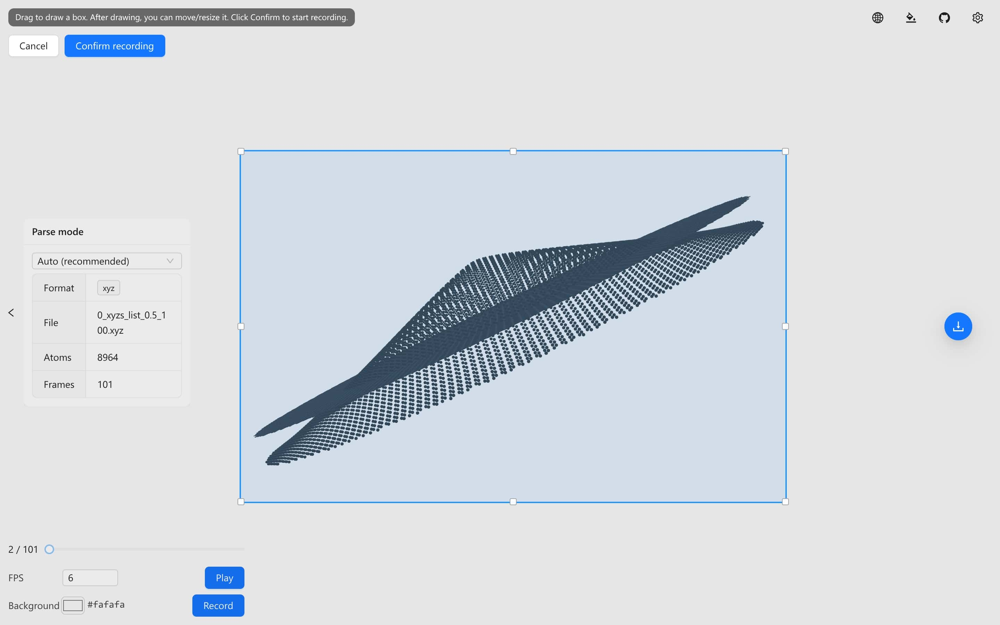

<div align="center">
  <a href="https://github.com/ldrfy/atoms_viewer">
    
  </a>
  <br>
  <br>

[](LICENSE)

  <h1>Ldr Atoms Viewer</h1>

[](readme/README_ZH.md) [](README.md)

</div>



## 🚀 Start

- Go [Web: Ldr-Atoms-Viewer](https://ldrfy.github.io/atoms_viewer/)
- Upload your file (`lammps-data`, `lammps-dump`, `pdb`, `xyz`)

| Camera       | CNT                               | MoS2_NT                             |
| ------------ | --------------------------------- | ----------------------------------- |
| Perspective  |        |      |
| Orthographic |        |      |
| \*.xyz       | [cnt.xyz](readme/samples/cnt.xyz) | [mos2.xyz](readme/samples/mos2.xyz) |

## Overview

This project is a modern web-based atomic structure viewer and PNG exporter. It allows users to load an `.xyz` file in the browser, visualize the atomic structure with smooth interaction, precisely tune rendering parameters (e.g., rotation angles and atom size), and export transparent PNG images with configurable resolution and automatic cropping.

The implementation prioritizes performance and responsiveness, leveraging a contemporary front-end stack.

## Features

- Video Recording

> Allows recording of rotation processes or trajectories, with customizable recording regions and different background colors.

- PNG Export

> Supports transparent or colored backgrounds, adjustable output resolution, and automatic cropping to the compact content bounding box.

- Smooth Performance & Multi-Device Support

> Capable of loading hundreds of thousands of atoms, and usable on various platforms including mobile and desktop.

- Multi-Format Support

> `lammps-data`, `lammps-dump`, `pdb`, `xyz`; `xyz` and `lammps-dump` support trajectory playback.

- Customization

> Multiple languages, dark/light themes, precise rotation control, atom size scaling, and toggle display for axes and bonds.

## 📦 Tech Stack

- Vue3
- Vite
- TypeScript
- Ant Design Vue
- three.js
- pnpm

## 🏗️ Development Testing

### Prerequisites

- Node.js (recommended: a recent LTS version)
- pnpm

### Install & Run

```bash
pnpm install
pnpm dev
```

### Build

```bash
pnpm build
pnpm preview
```

## Usage

1. Open the web app and upload an `.xyz` file.
2. Use the settings panel to tune the visualization (rotation angles, atom size, toggles, etc.).
3. Export a transparent PNG at the desired resolution; the image will be automatically cropped to a suitable bounding box.

## Reference & Credits

This project is inspired by the following online viewer in terms of goals and UX, while adopting a newer tech stack and aiming for smoother performance:

[openmx-viewer](https://www.openmx-square.org/viewer/index.html)

## Roadmap

- [ ] Support more structure file formats (e.g., CIF, POSCAR/CONTCAR, PDB)
- [ ] Improved bond detection/visualization
- [ ] More rendering and annotation options (measurements, labels, slicing, etc.)
