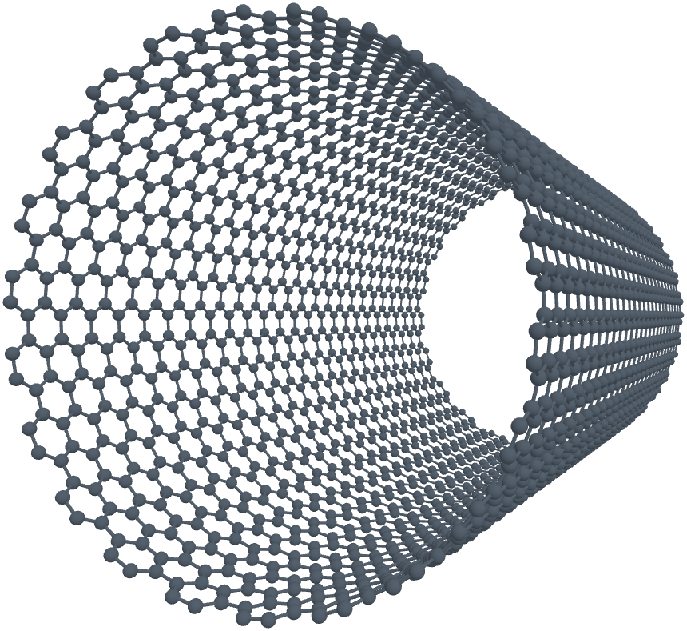
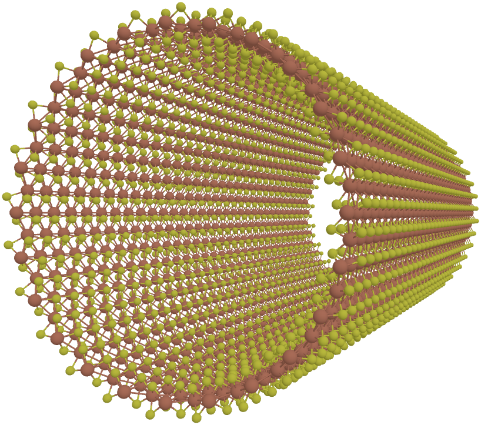
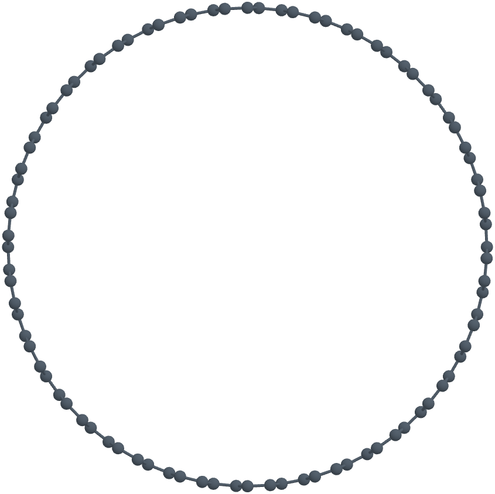

# Ldr-Atoms-Viewer

<div align="center">

[](readme/README_ZH.md) [](README.md)

</div>

## 🚀 Start

- Download xyz file: [cnt.xyz](readme/samples/cnt.xyz) or [mos2.xyz](readme/samples/mos2.xyz)
- Go [Web: Ldr-Atoms-Viewer](https://ldrfy.github.io/ldr_atoms_viewer/)
- Upload the xyz file

| Camera       | CNT                               | MoS2_NT                             |
| ------------ | --------------------------------- | ----------------------------------- |
| Perspective  |        |      |
| Orthographic |        |      |
| \*.xyz       | [cnt.xyz](readme/samples/cnt.xyz) | [mos2.xyz](readme/samples/mos2.xyz) |

## Overview

This project is a modern web-based atomic structure viewer and PNG exporter. It allows users to load an `.xyz` file in the browser, visualize the atomic structure with smooth interaction, precisely tune rendering parameters (e.g., rotation angles and atom size), and export transparent PNG images with configurable resolution and automatic cropping.

The implementation prioritizes performance and responsiveness, leveraging a contemporary front-end stack.

## Features

- **3D structure building (single-frame)**

  - Supports **LAMMPS data** (`lammps-data`), **XYZ** (single frame), and **PDB** for constructing and rendering a static 3D structure.

- **3D animation playback (multi-frame)**

  * Supports **LAMMPS dump** (`lammps-dump`) and **XYZ** (multi-frame) for time-series 3D animation playback.

- **Display & view controls**

  * Dark/Light theme
  * Multi-language (i18n)
  * Precise rotation control (X/Y/Z)
  * Atom size scaling
  * Toggles for axes and bonds

- **PNG export**

  * Transparent background
  * Configurable output resolution (custom scaling factor)
  * Automatic cropping to a tight content bounding box

- **Smooth user experience**

  * Designed to be more responsive and fluid than typical structure viewers


## 📦 Tech Stack

- Vue3
- Vite
- TypeScript
- Ant Design Vue
- three.js
- pnpm

## 🏗️ Development Testing

### Prerequisites

- Node.js (recommended: a recent LTS version)
- pnpm

### Install & Run

```bash
pnpm install
pnpm dev
```

### Build

```bash
pnpm build
pnpm preview
```

## Usage

1. Open the web app and upload an `.xyz` file.
2. Use the settings panel to tune the visualization (rotation angles, atom size, toggles, etc.).
3. Export a transparent PNG at the desired resolution; the image will be automatically cropped to a suitable bounding box.

## Reference & Credits

This project is inspired by the following online viewer in terms of goals and UX, while adopting a newer tech stack and aiming for smoother performance:

[openmx-viewer](https://www.openmx-square.org/viewer/index.html)

## Roadmap

- [ ] Support more structure file formats (e.g., CIF, POSCAR/CONTCAR, PDB)
- [ ] Improved bond detection/visualization
- [ ] More rendering and annotation options (measurements, labels, slicing, etc.)
