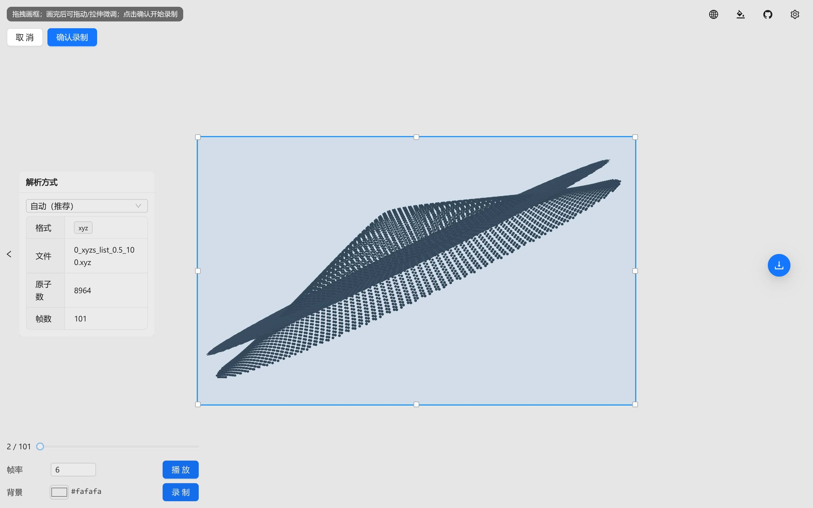

<div align="center">
  <a href="https://github.com/ldrfy/atoms_viewer">
    
  </a>
  <br>
  <br>

[](LICENSE)

  <h1>Ldr Atoms Viewer</h1>

[](readme/README_ZH.md) [](README.md)

</div>



## 🚀 开始使用

- 访问 [Web: Ldr-Atoms-Viewer](https://ldrfy.github.io/atoms_viewer/)
- 上传你自己的文件（`lammps-data`, `lammps-dump`, `pdb`, `xyz`）

| 0      | CNT                          | MoS2_NT                        |
| ------ | ---------------------------- | ------------------------------ |
| 透视   |          |        |
| 正交   |          |        |
| \*.xyz | [cnt.xyz](./samples/cnt.xyz) | [mos2.xyz](./samples/mos2.xyz) |

## 项目简介

本项目是一个基于 Web 的原子结构可视化与导出工具。用户可通过上传原子坐标文件在浏览器中构建并查看原子结构，可对显示效果进行精细调节（如旋转角度、原子大小等），同时支持一键导出透明背景、自动裁剪的高分辨率 PNG 图片。

项目以现代前端技术栈构建，交互流畅，渲染性能优先。

## 功能特性

- 录制视频

> 可录制转动过程或轨迹，可自定义录制区域、不同颜色背景

- PNG 导出

> 可选透明背景与不同颜色背景、可调整输出分辨率、自动裁剪到紧凑内容边界框

- 流畅与多设备支持

> 支持数十万原子加载，支持手机、电脑等各种平台使用

- 多格式支持

> `lammps-data`, `lammps-dump`, `pdb`, `xyz`，其中 `xyz` 和 `lammps-dump` 支持轨迹播放

- 自定义

> 多语言，深色/浅色主题，精确旋转控制，原子尺寸缩放，坐标轴与键的显示开关

## 📦 技术栈

- Vue3
- Vite
- TypeScript
- Ant Design Vue
- three.js
- pnpm

## 🏗️ 开发测试

### 环境要求

- Node.js（建议使用较新的 LTS 版本）
- pnpm

### 安装与运行

```bash
pnpm install
pnpm dev
```

### 构建

```bash
pnpm build
pnpm preview
```

## 使用说明

1. 打开网页后上传 `.xyz` 文件；
2. 在设置面板中调节显示参数（旋转角度、原子大小、显示开关等）；
3. 使用导出功能生成透明背景 PNG，可选择导出分辨率，并自动裁剪到合适尺寸。

## 参考与致谢

本项目在交互设计与功能目标上参考了以下在线查看器，但实现方式更现代化，性能与流畅性更优：

[openmx-viewer](https://www.openmx-square.org/viewer/index.html)

## 路线图

- [ ] 支持更多结构文件格式（如 CIF、POSCAR/CONTCAR、PDB 等）
- [ ] 更完善的键（bonds）识别与显示策略
- [ ] 更丰富的渲染样式与展示选项（如测量、截面、标注等）
